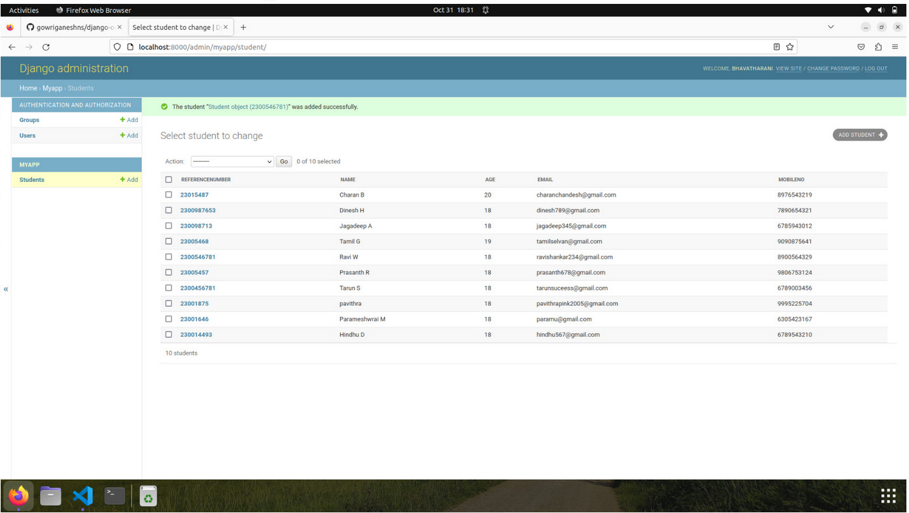

# Django ORM Web Application

## AIM
To develop a Django application to store and retrieve data from a database using Object Relational Mapping(ORM).

## Entity Relationship Diagram

Include your ER diagram here

## DESIGN STEPS

### STEP 1:

clone the github repository

### STEP 2:

write the appropriate code


### STEP 3:

run the program.

## PROGRAM
```
from django.db import models
from django.contrib import admin
# Create your models here.
class Student (models.Model):
    referencenumber=models.CharField(primary_key=True,max_length=20,help_text="reference number")
    name=models.CharField(max_length=100)
    age=models.IntegerField()
    email=models.EmailField()
    mobileno=models.IntegerField()

class StudentAdmin(admin.ModelAdmin):
    list_display=('referencenumber','name','age','email','mobileno')
    from django.contrib import admin
from django.urls import path

urlpatterns = [
    path('admin/', admin.site.urls),
]

```
## OUTPUT




## RESULT
Thus the program is excecuted successfully